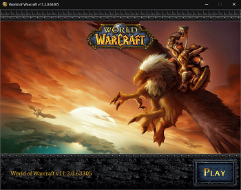
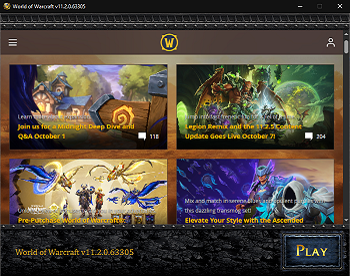

# WoWRetroLauncher

A retro launcher fork based on Parquelle/WoWRetroLauncher with a lot of compatibility

 

### Features
- Vanilla retro style
- Automatic lang detection: English + French
- Automatic game version detection (Retail, Classic, older versions like 1.12 / 2.4.3 / 3.3.5, etc)
- Realmlist detection for older versions (1.12 / 2.4.3 / 3.3.5)
- Available as 32 bit & 64 bit app
- Web frame

### Requirement / Installation
- .NET Framework 4.7.2 required
- Move the executable in your World of Warcraft folder (where your Wow.exe is located)
- You can rename the Launcher executable if needed

### Settings
- webFrameUri -> Set the web page you want to display on the launcher (64 bit only, default page is https://worldofwarcraft.blizzard.com/news)
